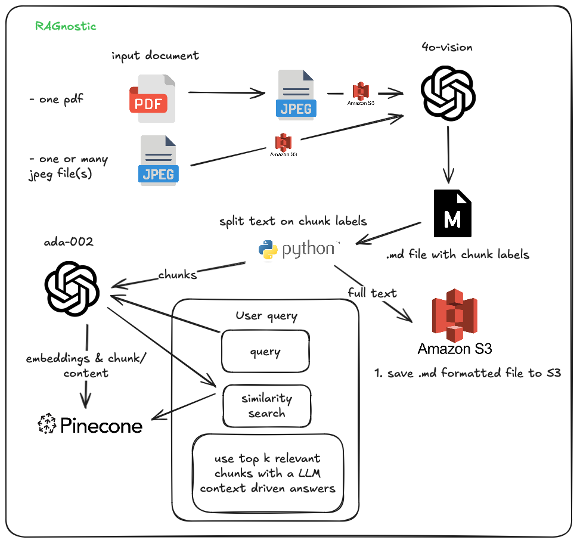

# 🪜 Welcome to **RAGnostic**  
**A simple, out-of-the-box, file-type-agnostic Retrieval-Augmented Generation (RAG) solution written in Python.**

- [Overview](https://github.com/dextercorley19/RAGnostic?tab=readme-ov-file#-overview)
- [Tech Stack](https://github.com/dextercorley19/RAGnostic?tab=readme-ov-file#-tech-stack)
- [Use Case](https://github.com/dextercorley19/RAGnostic?tab=readme-ov-file#-tech-stack)
- [Future Opportunities](https://github.com/dextercorley19/RAGnostic?tab=readme-ov-file#-tech-stack)

---

## 🚀 Overview  
RAGnostic is designed to seamlessly handle user-uploaded documents, creating an effective retrieval-based knowledge base for AI-powered chatbots. Its file-type agnostic approach ensures compatibility with various document formats, making it highly adaptable for diverse use cases. 

---



---

## 🛠️ Tech Stack  
- **Python**: Core language for development, managed with **Poetry**.  
- **AWS S3**: Scalable storage solution for user-uploaded documents.  
- **Pinecone DB**: High-performance vector database for managing embeddings.  
- **OpenAI**: State-of-the-art language models for enhanced query responses.  

---

## 💡 Pros/Cons  
RAGnostic is ideal for:  
1. **AI Chatbots** that require dynamic, document-driven knowledge stores and have no tolerance for for document-parsing error.  
2. **Knowledge Management Systems** with efficient document retrieval.
3. **Reccomendation Algorithms** to link users with similar knowledge bases.

Pros:
- Very accurate parsing.
- Can input almost anything including and not limited to: PDF's, photos of handwritten notes, screenshots, etx.
- Easy to use and setup with full code visibility.
- Framework agnostic, use any vector db, document db, LLM, all the logic will work the same.

Cons:
- Slower than a tradional document parsing tool.
- Slightly more expensive than a traditional document parsing tool.

---

## 🌟 Features & Future Opportunities  
### **UI/UX Enhancements**  
1. **Formatted Document Viewer**: Display uploaded documents in Markdown for an interactive, user-friendly experience.  
2. **Version History & Editing**: Enable users to modify original documents in Markdown, while ensuring updated embeddings are generated to maintain retrieval accuracy.  
3. **Visual Document Preview**: Offer users a JPEG preview of the original uploaded document for quick reference.  

---

## 👾 Get Started
### **Intro too RAGnostic and how to get started**  
Prerequisites:
- [Poetry installation](https://python-poetry.org/docs/#installation)
- [Pinecone Account](https://www.pinecone.io) with an index setup for to input 1536 dimensional embeddings.
- [AWS account](https://signin.aws.amazon.com/signup?request_type=register) with a S3 bucket created.
- [OpenAI developer account](https://platform.openai.com/docs/quickstart) that has at least $1 in the avaliable balance.

Step 1: Setup .env file
- Create .env file in /RAGnostic directory
- Copy over the contents of the .env.example file and replace the values with the keys you got from the last step.

Step 2: Setup poetry
- Poetry is a package manager that allows for easy dependency management for projects like this.
- In your terminal, naviagte to the RAGnostic directory that contains the pyproject.toml file. This is what we will build your python environment with.
- Run this command in your terminal:
```
poetry init
```

Step 3: Now that we have the .env file and poetry setup, lets create our first RAG system following the example included.
- The first script takes an input file, in this case a pdf, creates a JPEG for each page, and uses 4o vision to parse into markdown format. As well as labeling appropriate places to chunk the content. This step should take the longest.
```
poetry run python input.py
```

- The second script runs our formatted and labeled text document through a series of processing steps. The .md document first is saved, then a version gets stripped of the labels and saved into our S3 bucket for future use or unique UI/UX like version control and editability.
- Next, we chunk the other copy of the origional .md file and generate embeddings for each chunk, saving them as well as their content and related metadata in Pinecone.
```
poetry run python pipeline.py
```

- The third script simulates a chat-based enviroment in your terminal. Feel free to experiment with different values of k, prompts, and openai models.
```
poetry run python chat.py
```
